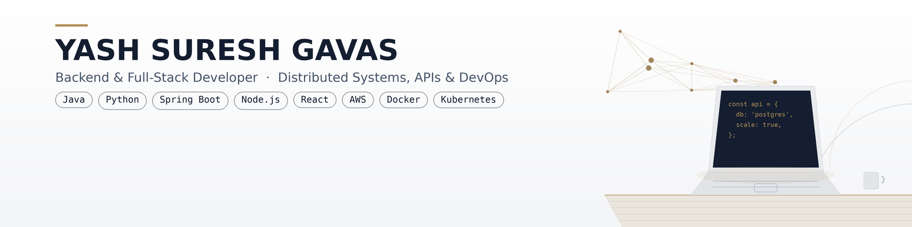

# portfolio-site

  

  

- 🌱 Currently deepening my expertise in **Distributed Systems & Advanced Backend Architecture**
- 💼 Recent experience: **Research Intern @ Samsung R&D Institute** (Java SDK for Samsung SmartThings, 50+ IoT devices) and **Python Developer Intern @ Praxien Tech** (workflow automation & operational analytics)
- 📄 Published researcher — co-author, *"SakhiSuraksha: An AI and IoT-Based Intelligent Emergency Response System for Women's Safety"*, IEEE IITCEE 2026
- 🎓 B.E. in Computer Science, M S Ramaiah Institute of Technology (CGPA 8.96/10) — Graduating Sep 2026
- 📫 Reach me at **yash.s.gavas@gmail.com**
- ✨ Fun fact: **I love Gaming**

<h3 align="left">Find me on</h3>

<h3 align="left">Languages and Tools:</h3>

*Also used, without a dedicated badge: RESTful API design/Microservices, Nagios, WebRTC, and Web3.js.*

<h3 align="left">Featured Projects</h3>

- **DEV-Arena** — AI-powered technical interview platform with a "Glass-Box" IDE (Next.js, FastAPI, Docker, GDB-MI, OpenAI Whisper, MediaPipe)
- **Voyage** — 8-service distributed microservices architecture with Netflix Eureka & polyglot persistence (Java Spring Boot, PostgreSQL, MongoDB, Vue.js)
- **Sakhi Suraksha** — Real-time AI threat detection app for women's safety, backing the IEEE-published research (React Native, Node.js, LLaMA3, PostgreSQL, WebRTC)
- **NestMatch** — Property listing platform with a full CI/CD & observability pipeline (React, Node.js, PostgreSQL, Docker, GitHub Actions, Prometheus, Grafana)
- **DefiHub** — Decentralized staking & portfolio dashboard (Solidity, React, Web3.js, MetaMask)

