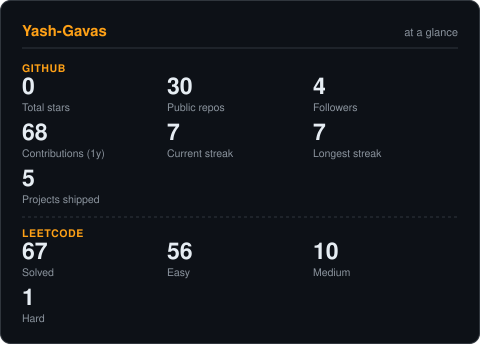
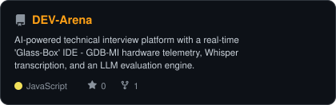
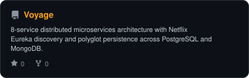
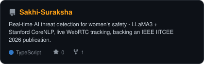
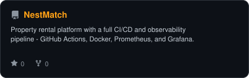

<div align="center">

<!-- PORTRAIT - generated by scripts/dotify.py from assets/portrait-source.png.
     Colour mode, so one file serves both GitHub themes. Regenerate with:
       python scripts/dotify.py assets/portrait-source.png -o assets/portrait \
         --cols 100 --equalize --detail 0.5 --color --reveal -->


<br>

<!-- NAME / TAGLINE - animated typing -->
<a href="https://github.com/Yash-Gavas">
  
</a>

<br>

<!-- SOCIALS -->
<a href="https://portfolio-dev-yash3.vercel.app/"></a>
<a href="https://github.com/Yash-Gavas"></a>
<a href="https://www.linkedin.com/in/yash-suresh-gavas-5aba28259/"></a>
<a href="mailto:yash.s.gavas@gmail.com"></a>
<a href="https://leetcode.com/u/YashGavas/"></a>
<a href="https://www.codechef.com/users/yash_gavas"></a>
<a href="https://codeforces.com/profile/Yash_Gavas"></a>
<a href="https://www.hackerrank.com/profile/yash_s_gavas"></a>


</div>

---

## `~/` whoami

```console
$ cat about.txt
```

Hi, I'm **Yash Suresh Gavas** — a Computer Science engineer who builds backend systems and
distributed architectures, and automates the parts of the job that don't need a human doing them twice.

- 🌱 Currently deepening my expertise in **Distributed Systems & Advanced Backend Architecture**
- 🏢 Research Intern @ **Samsung R&D Institute** (Oct 2024 – Jul 2025) — Java SDK for Samsung SmartThings across 50+ IoT devices
- 🐍 Python Developer Intern @ **Praxien Tech** (Feb – Apr 2026) — workflow automation & operational analytics, cut manual processing time 35%
- 📄 Published researcher — co-author, *"SakhiSuraksha: An AI and IoT-Based Intelligent Emergency Response System for Women's Safety"*, IEEE IITCEE 2026
- 🎓 B.E. in Computer Science, M S Ramaiah Institute of Technology (CGPA 8.96/10) — **Graduated Sep 2026**
- 📫 Reach me at **yash.s.gavas@gmail.com**
- ✨ Fun fact: **I love gaming**

<br>

<div align="center">

## `~/` toolbox


<br><br>


<br>

<sub><i>Also used, without a dedicated badge: RESTful APIs / Microservices, Nagios, GDB-MI, OpenAI Whisper, MediaPipe, LLMs &amp; RAG.</i></sub>

</div>

---

<div align="center">

## `~/` skill radar

<table>
<tr>
<td width="50%" align="center" valign="middle">

<!-- Self-rated radar - edit assets/skills.json, the workflow redraws it -->
<picture>
  <source media="(prefers-color-scheme: dark)"  srcset="assets/radar-dark.svg">
  <source media="(prefers-color-scheme: light)" srcset="assets/radar-light.svg">
  
</picture>

</td>
<td width="50%" align="center" valign="middle">

<!-- Live radar built from real language byte counts across your repos -->
<picture>
  <source media="(prefers-color-scheme: dark)"  srcset="assets/radar-langs-dark.svg">
  <source media="(prefers-color-scheme: light)" srcset="assets/radar-langs-light.svg">
  
</picture>

</td>
</tr>
</table>

</div>

---

<div align="center">

## `~/` the numbers

<!-- Generated by scripts/cards.py into this repo, not github-readme-stats /
     streak-stats / github-profile-trophy: those are shared public instances
     that go down and take the whole section with them. -->
<picture>
  <source media="(prefers-color-scheme: dark)"  srcset="assets/card-stats-dark.svg">
  <source media="(prefers-color-scheme: light)" srcset="assets/card-stats-light.svg">
  
</picture>

<br>


<br><br>


</div>

---

<div align="center">

## `~/` contribution calendar

<!-- 3D isometric calendar, regenerated every 6h by .github/workflows/metrics.yml -->


<br><br>

<!-- Snake eats the contribution graph - .github/workflows/snake.yml -->
<picture>
  <source media="(prefers-color-scheme: dark)"  srcset="https://raw.githubusercontent.com/Yash-Gavas/Yash-Gavas/output/snake-dark.svg">
  <source media="(prefers-color-scheme: light)" srcset="https://raw.githubusercontent.com/Yash-Gavas/Yash-Gavas/output/snake.svg">
  
</picture>

</div>

---

<div align="center">

## `~/` selected work

<!-- Cards generated by scripts/cards.py from assets/projects.json.
     Stars, forks and language are pulled live from the API on every run. -->
<table>
<tr>
<td width="50%">
  <a href="https://github.com/Yash-Gavas/DEV-Arena">
    <picture>
      <source media="(prefers-color-scheme: dark)"  srcset="assets/card-DEV-Arena-dark.svg">
      <source media="(prefers-color-scheme: light)" srcset="assets/card-DEV-Arena-light.svg">
      
    </picture>
  </a>
</td>
<td width="50%">
  <a href="https://github.com/Yash-Gavas/Voyage">
    <picture>
      <source media="(prefers-color-scheme: dark)"  srcset="assets/card-Voyage-dark.svg">
      <source media="(prefers-color-scheme: light)" srcset="assets/card-Voyage-light.svg">
      
    </picture>
  </a>
</td>
</tr>
<tr>
<td width="50%">
  <a href="https://github.com/Yash-Gavas/Sakhi-Suraksha">
    <picture>
      <source media="(prefers-color-scheme: dark)"  srcset="assets/card-Sakhi-Suraksha-dark.svg">
      <source media="(prefers-color-scheme: light)" srcset="assets/card-Sakhi-Suraksha-light.svg">
      
    </picture>
  </a>
</td>
<td width="50%">
  <a href="https://github.com/Yash-Gavas/NestMatch">
    <picture>
      <source media="(prefers-color-scheme: dark)"  srcset="assets/card-NestMatch-dark.svg">
      <source media="(prefers-color-scheme: light)" srcset="assets/card-NestMatch-light.svg">
      
    </picture>
  </a>
</td>
</tr>
</table>

<sub>

| project | stack | highlight |
|---|---|---|
| **[DEV-Arena](https://github.com/Yash-Gavas/DEV-Arena)** | `Next.js` `FastAPI` `Docker` `GDB-MI` `Whisper` `MediaPipe` | AI technical-interview platform with a "Glass-Box" IDE and live hardware telemetry tracing |
| **[Voyage](https://github.com/Yash-Gavas/Voyage)** | `Java Spring Boot` `Netflix Eureka` `PostgreSQL` `MongoDB` `Vue.js` | 8-service distributed architecture, polyglot persistence, 90% faster startup via PowerShell orchestration |
| **[Sakhi Suraksha](https://github.com/Yash-Gavas/Sakhi-Suraksha)** | `React Native` `Node.js` `LLaMA3` `PostgreSQL` `WebRTC` | Real-time AI threat detection for women's safety — backs the IEEE IITCEE 2026 publication |
| **[NestMatch](https://github.com/Yash-Gavas/NestMatch)** | `React` `Node.js` `PostgreSQL` `Docker` `GitHub Actions` `Prometheus` `Grafana` | Property listing platform with full CI/CD + observability, 70% faster deploys |
| **[DefiHub](https://github.com/Yash-Gavas/DefiHub)** | `Solidity` `React` `Web3.js` `MetaMask` | Decentralized staking & portfolio dashboard with live blockchain integration |

</sub>

</div>

---

<div align="center">

<sub>`01110100 01101000 01100001 01101110 01101011 01110011 00100000 01100110 01101111 01110010 00100000 01110110 01101001 01110011 01101001 01110100 01101001 01101110 01100111`</sub>

</div>
